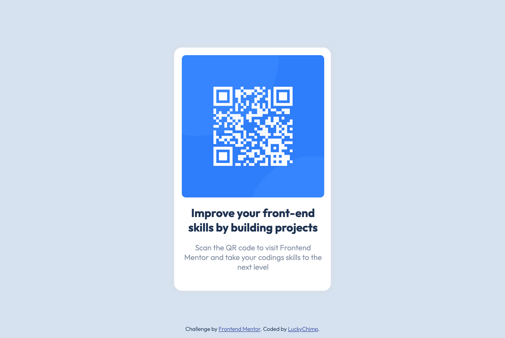

# Frontend Mentor - QR code component solution

This is a solution to the [QR code component challenge on Frontend Mentor](https://www.frontendmentor.io/challenges/qr-code-component-iux_sIO_H). Frontend Mentor challenges help you improve your coding skills by building realistic projects. 

## Table of contents

- [Overview](#overview)
  - [Screenshot](#screenshot)
  - [Link](#link)
- [Built with](#built-with)
- [Author](#author)

## Overview

### Screenshot

### Link

- Solution URL: [https://luckychimp.github.io/qr-code-component/](https://luckychimp.github.io/qr-code-component/)

## Built with

- Semantic HTML5 markup
- SCSS for clean, easy and less CSS
- Flexbox

## Author

- Frontend Mentor - [@LuckyChimp](https://www.frontendmentor.io/profile/LuckyChimp)
